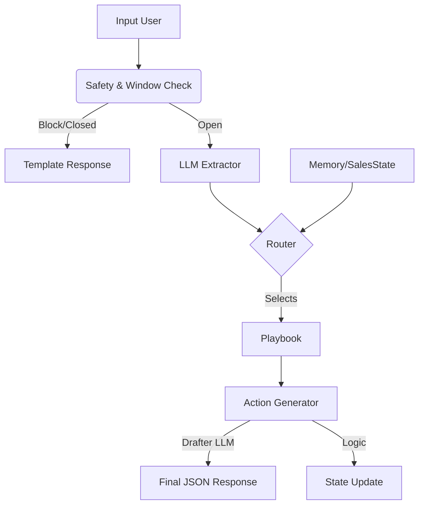

# DISEÑO TÉCNICO: DE MOTOR REACTIVO A MOTOR VENDEDOR HÍBRIDO

## SECCIÓN 1 — MAPA DEL SISTEMA ACTUAL (AS-IS)

Actualmente, el sistema funciona como un **clasificador monolítico** que delega toda la inteligencia (comprensión + decisión + acción) a una sola llamada de LLM.

### Flujo Real (`apps/motor_response/api.py`)

1.  **Entrada**: `POST /v1/motor/respond` recibe `turn_wamid`, `text`, `contact_key`.
2.  **Validación**:
    *   **Deduplicación**: Verifica caché con `turn_wamid` (Idempotencia).
    *   **Locking**: Spin-lock para evitar condiciones de carrera en el mismo mensaje.
3.  **Carga de Contexto**:
    *   Busca/Crea `Tenant`.
    *   Busca `Contact` y `MemoryRecord`.
    *   Calcula `window_open` (último mensaje usuario vs ahora).
4.  **Reglas Duras (Pre-LLM)**:
    *   **Safety**: Si detecta palabras ofensivas (`OFFENSIVE`), corta flujo y devuelve `BLOCK` + Template `SAFE_BOUNDARY`.
    *   **Ventana Cerrada (Parcial)**: Si no hay eventos configurados y ventana cerrada, fuerza template.
5.  **LLM Monolítico**:
    *   Construye `classifier_input` con TODO: memoria, eventos (`TenantEvent`), templates.
    *   Llama a `classify_with_openai` (Stored Prompt).
    *   **El Prompt decide todo**: Qué evento es, qué política aplicar (`FREEFORM` vs `TEMPLATE`) y qué `next_actions` generar.
6.  **Normalización y Persistencia**:
    *   Parsea el JSON del LLM.
    *   Aplica fallbacks si el LLM falla (ej. fuerza `REOPEN_24H` si ventana cerrada).
    *   Actualiza `MemoryRecord` (summary, facts, events).
7.  **Salida**: Retorna JSON con `decision`, `policy`, `next_actions`.

**Problema Arquitectónico**: El "Cerebro" (LLM) está sobrecargado. Si le pedimos que "venda", alucinará o perderá el contexto de reglas rígidas. No hay separación entre "entender qué pasó" y "decidir qué hacer".

---

## SECCIÓN 2 — DEFINICIÓN DEL SISTEMA FUTURO (TO-BE)

El nuevo diseño rompe el monolito en una **cadena de montaje (Pipeline)**. El LLM deja de ser el "Jefe" y pasa a ser un "Operario Especializado" (solo ve, no decide estrategia).

### Cambio de Paradigma

| Concepto | Sistema Actual (Reactivo) | Sistema Futuro (Vendedor Híbrido) |
| :--- | :--- | :--- |
| **Entrada** | Texto + Eventos | Texto + Estado de Venta |
| **Rol del LLM** | Dios (Clasifica + Decide + Redacta) | **Extractor** (Solo estructura señales) + **Redactor** (Solo obedece reglas) |
| **Cerebro** | Prompt Implícito | **Router Determinístico** (Código Python) |
| **Estrategia** | Inexistente (Reactiva) | **Playbooks** (Jugadas predefinidas) |
| **Estado** | Resumen de texto (`summary`) | **Sales State** (JSON estructurado) |

### Arquitectura de Bloques

1.  **Ojos (Extractor)**: LLM liviano que solo saca datos limpios.
2.  **Memoria (Sales State)**: Ficha técnica del lead (no solo resumen).
3.  **Cerebro (Router)**: `if/else` glorificado que prioriza negocio sobre charla.
4.  **Jugada (Playbook)**: Receta de qué hacer (Objetivo + CTA + Datos a pedir).
5.  **Boca (Action Gen)**: Genera el output final (Template o LLM acotado).

---

## SECCIÓN 3 — BLOQUES FUNCIONALES DEL NUEVO SISTEMA

### BLOQUE 1 — Extractor de Señales (LLM)
*   **Objetivo**: Convertir texto no estructurado en datos estructurados confiables.
*   **Responsabilidad**: Identificar intención, objeciones, entidades y sentimiento. NO decide qué responder.
*   **Arquitectura**: Función Python que llama a OpenAI con un Stored Prompt específico (`EXTRACTOR_V1`).
*   **Entrada**: Texto del usuario, Historial reciente (muy breve).
*   **Salida**: Objeto `Signals` (Intent, Entities, Objection, Risk).
*   **Impacto**: Reemplaza al actual `classify_with_openai` monolítico.

### BLOQUE 2 — Sales State (Memoria Estructurada)
*   **Objetivo**: Mantener la "foto" comercial del lead.
*   **Responsabilidad**: Saber en qué etapa del funnel está, qué datos faltan (presupuesto, modelo) y nivel de interés.
*   **Arquitectura**: Nuevo campo `sales_state_json` en `MemoryRecord`.
*   **Estructura**:
    ```json
    {
      "stage": "DISCOVERY",
      "missing_info": ["model", "budget"],
      "last_objection": "PRICE",
      "temperature": "COLD"
    }
    ```
*   **Impacto**: Requiere migración de DB en `MemoryRecord`.

### BLOQUE 3 — Router Determinístico (Cerebro)
*   **Objetivo**: Seleccionar el Playbook correcto basándose en reglas de negocio.
*   **Responsabilidad**: Aplicar la pirámide de prioridad (Riesgo > Ventana > Handoff > Objeción > Intención).
*   **Arquitectura**: Clase Python `SalesRouter` con método `decide_playbook(signals, state)`.
*   **Tecnologías**: Python puro. Lógica dura, auditable y testeable.
*   **Entrada**: `Signals` (del Extractor) + `SalesState` (de DB).
*   **Salida**: `playbook_key` (ej: `OBJECTION_PRICE`).

### BLOQUE 4 — Playbook Engine
*   **Objetivo**: Estandarizar las estrategias de venta.
*   **Responsabilidad**: Definir las reglas de redacción y acciones para cada jugada.
*   **Arquitectura**: Registro de clases/diccionarios `PLAYBOOK_REGISTRY`.
*   **Contrato**: Cada playbook define:
    *   `goal`: Qué lograr.
    *   `style`: Tono.
    *   `constraints`: Qué NO decir.
    *   `required_actions`: Acciones técnicas obligatorias (ej. guardar dato).
*   **Casos de uso**: `DISCOVERY_MIN`, `PRICE_QUOTE`, `SAFE_BOUNDARY`.

### BLOQUE 5 — Generador de Acciones (Action Gen)
*   **Objetivo**: Producir los `next_actions` finales para el orquestador.
*   **Responsabilidad**:
    *   Si el playbook es estático (Template): Generar `SEND_MESSAGE`.
    *   Si el playbook es dinámico (Texto): Llamar a un LLM "Redactor" (`DRAFTER_V1`) con las reglas del playbook.
*   **Entrada**: `Playbook`, `SalesState`, `Signals`.
*   **Salida**: Lista de `next_actions`.

---

## SECCIÓN 4 — CONTRATOS DE DATOS DEL SISTEMA

### 1. Contrato del Extractor (Salida LLM 1)
```json
{
  "primary_intent": "ASK_PRICE",
  "entities": {
    "vehicle_model": "Hilux",
    "budget": "20k"
  },
  "risk": {
    "flag": false,
    "reason": null
  },
  "objection": null,
  "sentiment": "NEUTRAL"
}
```

### 2. Contrato de Sales State (DB)
```json
{
  "funnel_step": "QUALIFICATION", // DISCOVERY, QUALIFICATION, NEGOTIATION, CLOSED
  "collected_data": {
    "name": "Juan",
    "model_interest": "Hilux"
  },
  "pending_data": ["budget", "timeframe"],
  "last_agent_move": "ASK_BUDGET"
}
```

### 3. Contrato del Router (Salida)
```python
@dataclass
class RouterDecision:
    playbook_key: str  # "PRICE_OBJECTION_HANLING"
    reason: str        # "User has high intent but price objection"
    priority_level: int # 1 (Critical) to 5 (Info)
```

### 4. Contrato de Next Actions (Salida Final API)
*Se mantiene compatible con el actual para no romper el orquestador, pero con contenido más rico.*
```json
[
  {
    "type": "CALL_TEXT_AI", // O SEND_MESSAGE si es template
    "prompt_key": "DRAFTER_V1", // Nuevo prompt solo de redacción
    "input_json": {
       "instructions": "Acknowledge price objection. Pivot to value. Ask for visit.",
       "context": "..."
    }
  },
  {
    "type": "UPDATE_CRM", // Nueva acción posible
    "payload": { "stage": "NEGOTIATION" }
  }
]
```

---

## SECCIÓN 5 — DIAGRAMAS

### Flujo de Datos Futuro


### Lógica de Decisión del Router (Python)
```text
IF risk_flag IS True:
    RETURN Playbook("SAFE_BOUNDARY")
ELSE IF window_open IS False:
    RETURN Playbook("REOPEN_24H")
ELSE IF intent == "HANDOFF_REQUEST":
    RETURN Playbook("HANDOFF")
ELSE IF objection IS NOT None:
    RETURN Playbook("HANDLE_OBJECTION", type=objection)
ELSE IF sales_state.missing_critical_data:
    RETURN Playbook("DISCOVERY_MIN", field=missing_data[0])
ELSE:
    RETURN Playbook("DEFAULT_ASSIST")
```

---

## SECCIÓN 6 — ESPECIFICACIÓN DE APIs Y PUNTOS DE INTEGRACIÓN

### Endpoint Principal (`api.py`)
Se mantiene `POST /v1/motor/respond`.
*   **Request**: Idéntico (`MotorRespondIn`).
*   **Response**: Idéntico (`MotorRespondOut`), pero la calidad de `next_actions` cambia.
*   **Cambio interno**: `motor_respond` deja de llamar a `classify_with_openai` monolítico y pasa a orquestar el pipeline `Extractor -> Router -> Gen`.

### Integración con OpenAI
Se necesitarán **DOS** Stored Prompts nuevos (o uno muy versátil):
1.  `EXTRACTOR_PROMPT_ID`: Solo para extraer señales.
2.  `DRAFTER_PROMPT_ID`: Solo para redactar el mensaje final siguiendo instrucciones rígidas.

---

## SECCIÓN 7 — CAMBIOS PROPUESTOS SOBRE EL SISTEMA ACTUAL

| Archivo | Estado Actual | Cambio Propuesto |
| :--- | :--- | :--- |
| `apps/whatsapp_inbound/models.py` | `MemoryRecord` tiene `facts_json`. | **Agregar `sales_state_json`** (JSONField). |
| `apps/motor_response/api.py` | Lógica monolítica en `_motor_respond_impl`. | **Refactorizar** para llamar a `Extractor`, `Router` y `Generator` secuencialmente. |
| `apps/motor_response/llm_classifier.py` | `classify_with_openai` hace todo. | Crear `extract_signals()` y `draft_response()`. |
| `apps/motor_response/schemas.py` | Schemas de I/O API. | Agregar schemas internos (`Signal`, `SalesState`). |
| `apps/motor_response/router.py` | **No existe**. | **Crear nuevo**. Contendrá la lógica de prioridad. |
| `apps/motor_response/playbooks.py` | **No existe**. | **Crear nuevo**. Registro de playbooks y reglas. |

---

## SECCIÓN 8 — ESTRATEGIA DE IMPLEMENTACIÓN POR FASES

### Fase 1: Cimientos (Sin romper nada)
*   Objetivo: Crear estructuras de datos y Extractor.
*   Acciones:
    *   Migración DB: Agregar `sales_state_json`.
    *   Crear `apps/motor_response/router.py` (vacío/dummy).
    *   Crear prompt de Extracción.
*   Validación: Tests unitarios del Extractor.

### Fase 2: El Cerebro (Router)
*   Objetivo: Implementar lógica de decisión.
*   Acciones:
    *   Implementar `SalesRouter`.
    *   Definir Playbooks básicos (`SAFE`, `REOPEN`, `DISCOVERY`).
*   Validación: Tests de lógica pura (Input simulado -> Playbook esperado).

### Fase 3: Conexión (Pipeline)
*   Objetivo: Conectar el endpoint al nuevo flujo.
*   Acciones:
    *   Modificar `api.py` para usar el Pipeline.
    *   Mantener el sistema viejo como fallback si falla el Router.
*   Validación: E2E Tests.

---

## SECCIÓN 9 — RIESGOS TÉCNICOS Y DECISIONES ABIERTAS

1.  **Latencia**: Pasar de 1 llamada LLM a 2 (Extractor + Redactor) duplicará la latencia y costo.
    *   *Mitigación*: Usar modelo rápido (gpt-4o-mini) para Extractor.
2.  **Migración de Memoria**: Los `MemoryRecord` viejos no tendrán `sales_state`.
    *   *Decisión*: Iniciar `sales_state` vacío/default al leer registros viejos.
3.  **Orquestador (n8n)**: Si el orquestador espera que `next_actions` tenga un formato muy específico y lo cambiamos, se rompe.
    *   *Garantía*: Mantener el contrato JSON de salida idéntico, solo cambiar el *contenido* de las instrucciones.

---

## SECCIÓN 10 — DISEÑO FINAL RECOMENDADO

Recomiendo proceder con la arquitectura de **Pipeline Modular** descrita.

**Por qué:**
1.  **Control**: Sacamos la lógica de negocio del "Caja Negra" del LLM y la ponemos en código Python auditable (`Router`).
2.  **Escalabilidad**: Agregar un nuevo Playbook es agregar una clase/configuración, no re-entrenar un prompt gigante.
3.  **Venta Real**: Permite persistir el estado del funnel, algo imposible con el modelo actual puramente reactivo.

**Pasos inmediatos para el desarrollador:**
1.  Crear `router.py` y `playbooks.py` en `apps/motor_response`.
2.  Definir los Pydantic models para `SalesState` y `Signals`.
3.  Escribir el algoritmo de prioridad en el Router.
